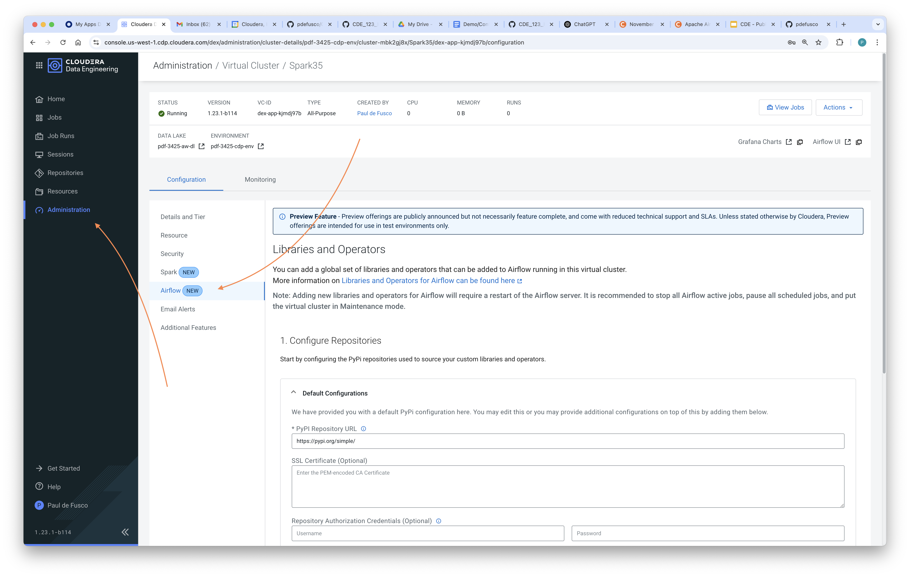
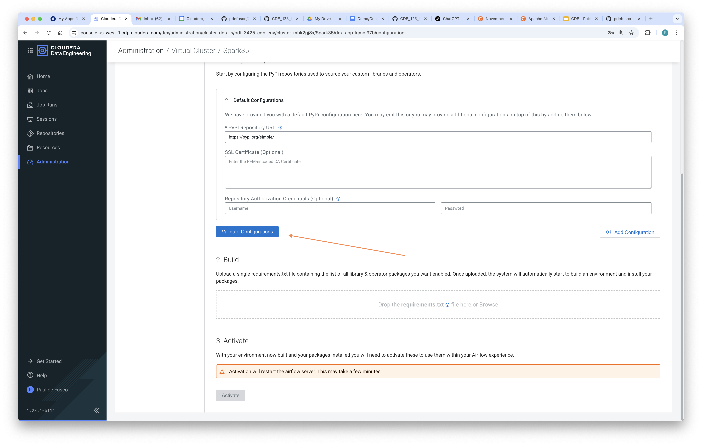
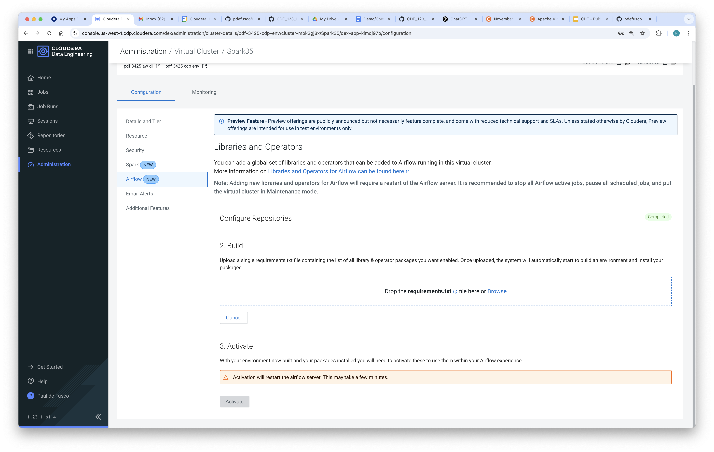
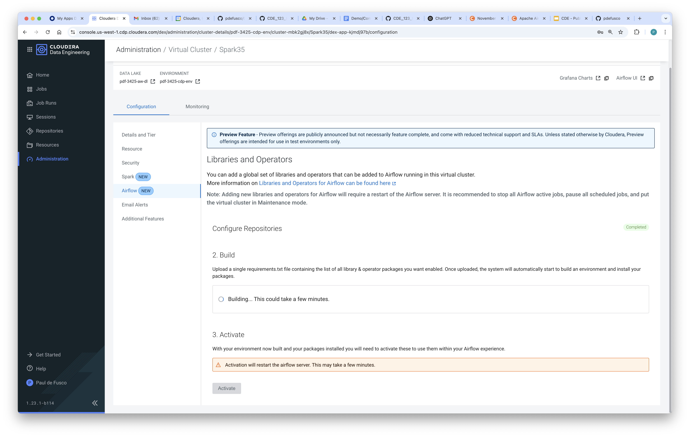
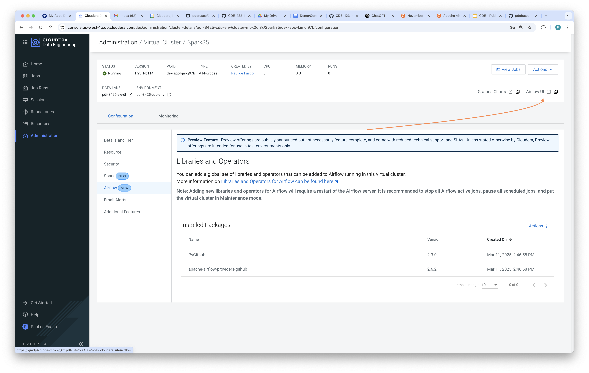
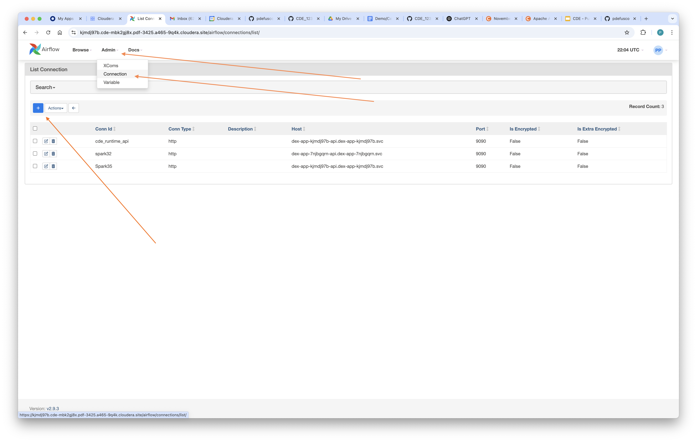
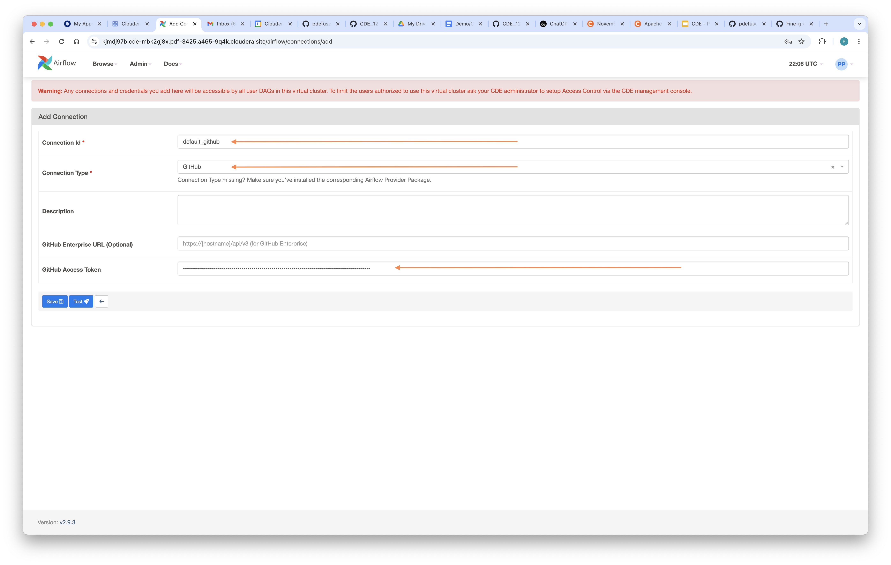
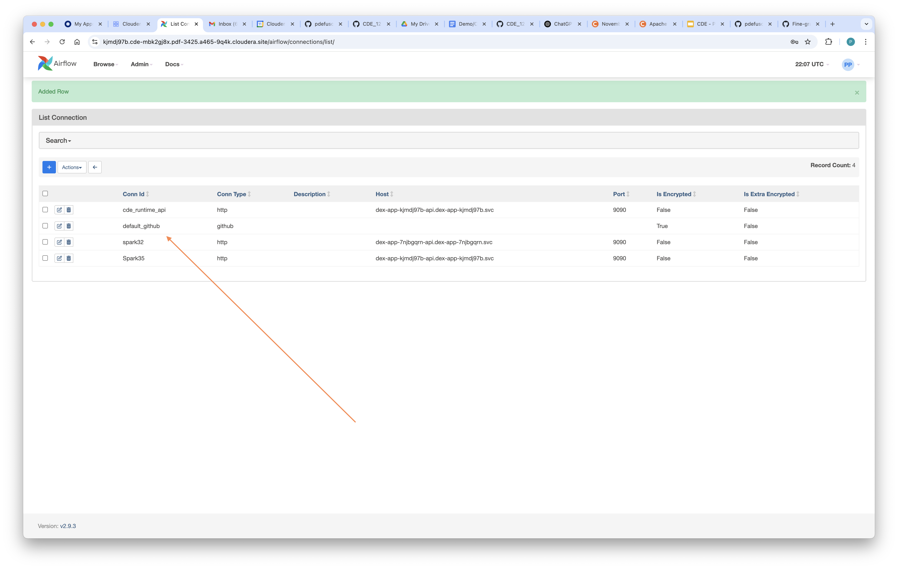

# CDE HOL Setup

## Objective

This document provides instructions for setting up HOL dependencies. The HOL lead must complete these steps as a requirement prior to the HOL event date.


## Table of Contents

* [Requirements](https://github.com/pdefusco/CDE_123_HOL/tree/main/setup#requirements)
* [Deployment Instructions](https://github.com/pdefusco/CDE_123_HOL/tree/main/setup#deployment-instructions)
* [Teardown Instructions](https://github.com/pdefusco/CDE_123_HOL/tree/main/setup#teardown-instructions)
* [Python Utils](https://github.com/pdefusco/CDE_123_HOL/tree/main/setup#python-utils)
* [Summary](https://github.com/pdefusco/CDE_123_HOL/tree/main/setup#summary)


## Requirements

To deploy the demo via this automation you need:

* A CDP tenant in Public or Private cloud.
* A CDP Workload User with Ranger policies and IDBroker Mappings configured accordingly.
* An CDE Service on version 1.23 or above.
* A CDE Spark 3.2 Virtual Cluster foe data generation and at least one CDE Spark 3.5 for the labs.
* A working local installation of the CDE CLI.
* The Docker Custom Runtime entitlement. Please contact the CDE product or sales team to obtain the entitlement.
* A Dockerhub account. Keep your Dockerhub user and password handy.
* A GitHub account. Keep have your GitHub token handy.


## Deployment Instructions

There are three setup steps. All three can be done in parallel.

1. Create data in a Spark 3.2 or 3.3 VC.
2. Create shared participant resources (files and Python resources) in all the Spark 3.5 VC's used throughout the labs.
3. Airflow configurations.

In order to complete these requirements, clone this repository in your local machine and follow the steps below.

#### 1. Run deploy_hol.py in the Spark 3.5 Virtual Cluster.

Even if you have multiple Spark 3.5 VC's, this step only needs to be done once in your Spark 3.2 or 3.3 VC.

Before proceeding, make sure to update your ~/.cde/config.yaml with your Spark 3.2 or 3.3 Virtual Cluster's CDE Jobs API URL.

Deployment script command template:

```
% ./setup/new_deploy_hol.sh <cdp-workload-user> <max-hol-participants> <storage-location>
```

Make sure to always choose the data directory. For example:

```
#AWS
% ./setup/new_deploy_hol.sh pauldefusco 10 s3a://goes-se-sandbox/data/cde-123-hol
```

```
#Azure
% ./setup/new_deploy_hol.sh pauldefusco 7 abfs://logs@go01demoazure.dfs.core.windows.net/data/cde-123-hol
```

#### 2. Run deploy_hol_resources.py in all the Spark 3.5 Virtual Clusters used by Participants.

You must repeat these steps for each Spark 3.5 VC in which HOL participants will work through the labs.

Before proceeding, make sure to update your ~/.cde/config.yaml with your Spark 3.5 Virtual Cluster's CDE Jobs API URL.

Deployment script command template:

```
% ./setup/deploy_hol_resources.sh <cdp-workload-user>
```

For example:

```
#AWS
% ./setup/deploy_hol_resources.sh pauldefusco
```

```
#Azure
% ./setup/deploy_hol_resources.sh pauldefusco
```

#### 3. Airflow Configurations

In this step you will install the GitHub operator in the Airflow Python Environment and create the GitHub Airflow connection in all the Spark 3.5 VC's used throughout the labs. You must repeat these steps for each Spark 3.5 VC in which HOL participants will work through the labs.

First, open the Airflow tab of the Virtual Cluster Details page and install the GitHub operator as shown below.










Then, create the GitHub Connection. Make sure to name the Conection ID with "default_github" and then paste the GitHub token in the respective field.










## Teardown Instructions

When you are done run this script to tear down the data in the Catalog but not in S3. That step will be handles by the GOES teardown scripts.

```
% ./teardown.sh cdpworkloaduser
```

## Python Utils

#### Destroy All Jobs for an HOL Participant

You can delete all jobs created by a particular hol user by running the "setup/destroy_jobs.py" script from your local machine.

This is useful when a particular hol participant needs to start the labs from scratch after having completed only some of the labs.

Before running, edit the following parameters:

* Lines 48, 49: add Jobs API URL's of Virtual Clusters where you want to remove the user's jobs.
* Line 50: add hol_username e.g. "user001"
* Line 52: workload username for authenticating against the CDE VC.
* Line 53: workload password for authenticating against the CDE VC.

## Summary

You can deploy an end to end CDE Demo with the provided automation. The demo executes a small ETL pipeline including Iceberg, Spark and Airflow.
