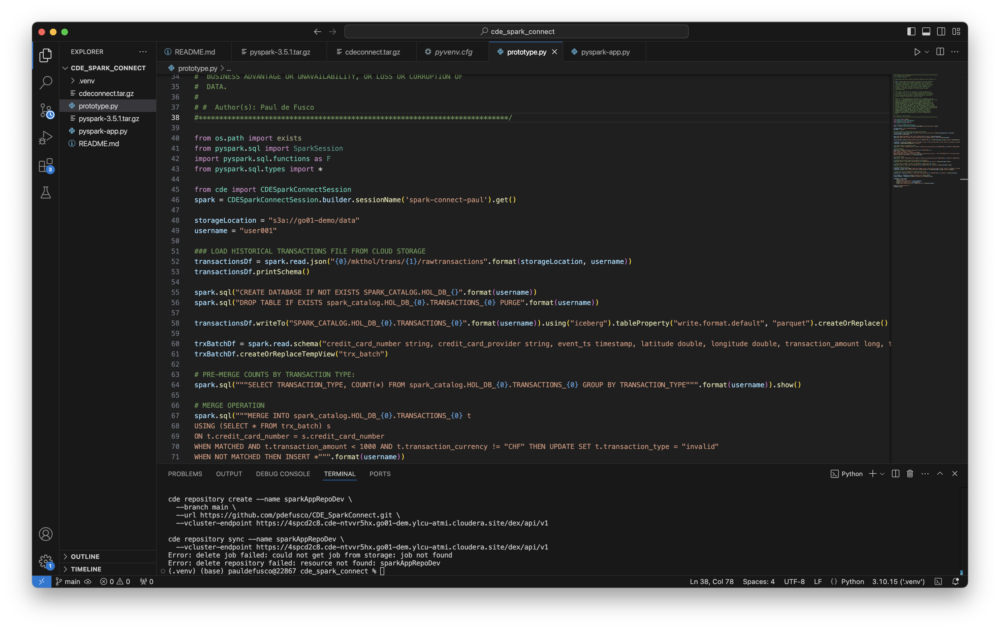

# CDE 1.23 Hands on Lab

1. [Test jobs with Spark Connect from local](https://github.com/pdefusco/CDE_SparkConnect?tab=readme-ov-file#1-test-jobs-in-cde-session-from-local).  
2. [Once ready for operationalization push to git](https://github.com/pdefusco/CDE_SparkConnect?tab=readme-ov-file#2-push-to-git).
3. [Sync with CDE repository](https://github.com/pdefusco/CDE_SparkConnect?tab=readme-ov-file#3-sync-with-cde-repository)
4. [Deploy using CLI](https://github.com/pdefusco/CDE_SparkConnect?tab=readme-ov-file#4-deploy-using-cli)
5. [Monitor](https://github.com/pdefusco/CDE_SparkConnect?tab=readme-ov-file#5-monitor)
6. [Promote to higher env using API by replicating repo and redeploy](https://github.com/pdefusco/CDE_SparkConnect?tab=readme-ov-file#6-promote-to-higher-env-using-api-by-replicating-repo-and-redeploy)

We will prototype and test the Iceberg Merge Into and Incremental Read Operations.

# Instructions

## 1. Test jobs in CDE Session from local

Start a CDE Session of type Spark Connect. Then, run "prototype.py".



On your terminal run the following commands:

```
cde spark submit \
  pyspark-app.py \
  --vcluster-endpoint https://4spcd2c8.cde-ntvvr5hx.go01-dem.ylcu-atmi.cloudera.site/dex/api/v1 \
  --executor-memory "4g" \
  --executor-cores 2
```

You are ready to test the Spark Submit as a CDE Spark Job.

## 2. Push to git

This code is looking good. Let's push updates to the git repo.

```
git add pyspark-app.py
git commit -m "developed pyspark job"
git push
```

We can now create a CDE Repository in order to import the application into the Virtual Cluster.

## 3. Sync with CDE repository

Create a CDE repository and create the CDE Spark Job using the contents.

First, delete the job and repository in case they have been created before.

```
cde job delete \
  --name cde_spark_job_test \
  --vcluster-endpoint https://4spcd2c8.cde-ntvvr5hx.go01-dem.ylcu-atmi.cloudera.site/dex/api/v1

cde repository delete \
  --name sparkAppRepoDev \
  --vcluster-endpoint https://4spcd2c8.cde-ntvvr5hx.go01-dem.ylcu-atmi.cloudera.site/dex/api/v1
```

Now create the CDE Repository and sync it with the Git Repository.

```
cde repository create --name sparkAppRepoDev \
  --branch main \
  --url https://github.com/pdefusco/CDE_SparkConnect.git \
  --vcluster-endpoint https://4spcd2c8.cde-ntvvr5hx.go01-dem.ylcu-atmi.cloudera.site/dex/api/v1

cde repository sync --name sparkAppRepoDev \
  --vcluster-endpoint https://4spcd2c8.cde-ntvvr5hx.go01-dem.ylcu-atmi.cloudera.site/dex/api/v1
```

## 4. Deploy using CLI

Now create a CDE Spark job using the CDE Repository as a dependency.

The files in the Repository are mounted and reachable by the Application at runtime.

```
cde job create --name cde_spark_iceberg_job_test \
  --type spark \
  --mount-1-resource sparkAppRepoDev \
  --executor-cores 2 \
  --executor-memory "4g" \
  --application-file pyspark-app.py\
  --vcluster-endpoint https://4spcd2c8.cde-ntvvr5hx.go01-dem.ylcu-atmi.cloudera.site/dex/api/v1

cde job run --name cde_spark_iceberg_job_test \
  --executor-cores 4 \
  --executor-memory "2g" \
  --vcluster-endpoint https://4spcd2c8.cde-ntvvr5hx.go01-dem.ylcu-atmi.cloudera.site/dex/api/v1
```

## 5. Monitor

Navigate to the Job Runs UI / run a few CDE CLI commands to check status.

```
# List all Jobs in the Virtual Cluster:
cde job list \
  --vcluster-endpoint https://4spcd2c8.cde-ntvvr5hx.go01-dem.ylcu-atmi.cloudera.site/dex/api/v1

# List all jobs in the Virtual Cluster whose name is "cde_spark_job_test":
cde job list \
  --filter 'name[eq]cde_spark_iceberg_job_test' \
  --vcluster-endpoint https://4spcd2c8.cde-ntvvr5hx.go01-dem.ylcu-atmi.cloudera.site/dex/api/v1

# List all jobs in the Virtual Cluster whose job application file name equals "pyspark-app.py":
cde job list \
  --filter 'spark.file[eq]pyspark-app.py' \
  --vcluster-endpoint https://4spcd2c8.cde-ntvvr5hx.go01-dem.ylcu-atmi.cloudera.site/dex/api/v1

# List all runs for Job "cde_spark_job_test":
cde run list \
  --filter 'job[eq]cde_spark_iceberg_job_test' \
  --vcluster-endpoint https://4spcd2c8.cde-ntvvr5hx.go01-dem.ylcu-atmi.cloudera.site/dex/api/v1
```

## 6. Promote to higher env using API by replicating repo and redeploy

Now that the job has succeeded, import it into the PRD cluster.

First delete the job and repository in case they have already been created.

```
cde job delete \
  --name cde_spark_job_prd \
  --vcluster-endpoint https://762hjztc.cde-ntvvr5hx.go01-dem.ylcu-atmi.cloudera.site/dex/api/v1

cde repository delete \
  --name sparkAppRepoPrd \
  --vcluster-endpoint https://762hjztc.cde-ntvvr5hx.go01-dem.ylcu-atmi.cloudera.site/dex/api/v1
```

Create and sync the same Git repo from the PRD Cluster:

```
cde repository create --name sparkAppRepoPrd \
  --branch main \
  --url https://github.com/pdefusco/CDE_SparkConnect.git \
  --vcluster-endpoint https://762hjztc.cde-ntvvr5hx.go01-dem.ylcu-atmi.cloudera.site/dex/api/v1

cde repository sync --name sparkAppRepoPrd \
 --vcluster-endpoint https://762hjztc.cde-ntvvr5hx.go01-dem.ylcu-atmi.cloudera.site/dex/api/v1

cde job create --name cde_spark_job_prd \
  --type spark \
  --mount-1-resource sparkAppRepoPrd \
  --executor-cores 2 \
  --executor-memory "4g" \
  --application-file pyspark-app.py\
  --vcluster-endpoint https://762hjztc.cde-ntvvr5hx.go01-dem.ylcu-atmi.cloudera.site/dex/api/v1

cde job run --name cde_spark_job_prd \
  --executor-cores 4 \
  --executor-memory "2g" \
  --vcluster-endpoint https://762hjztc.cde-ntvvr5hx.go01-dem.ylcu-atmi.cloudera.site/dex/api/v1
```

## 7. Build Orchestration Pipeline with Airflow

Delete existing jobs in case they have been created.

```
cde job delete \
  --name airflow-orchestration \
  --vcluster-endpoint https://vtr4tm46.cde-vwkzdqwc.paul-aug.a465-9q4k.cloudera.site/dex/api/v1

cde job delete \
  --name cde_spark_job_gold \
  --vcluster-endpoint https://vtr4tm46.cde-vwkzdqwc.paul-aug.a465-9q4k.cloudera.site/dex/api/v1

cde job delete \
  --name cde_spark_job_silver \
  --vcluster-endpoint https://vtr4tm46.cde-vwkzdqwc.paul-aug.a465-9q4k.cloudera.site/dex/api/v1

cde job delete \
  --name cde_spark_job_bronze \
  --vcluster-endpoint https://vtr4tm46.cde-vwkzdqwc.paul-aug.a465-9q4k.cloudera.site/dex/api/v1

cde repository sync --name sparkAppRepoPrd \
 --vcluster-endpoint https://vtr4tm46.cde-vwkzdqwc.paul-aug.a465-9q4k.cloudera.site/dex/api/v1
```

First create the CDE Spark jobs. Then create the CDE Airflow job.

```
cde job create --name cde_spark_job_bronze \
  --type spark \
  --arg pauldefusco \
  --arg s3a://paul-aug26-buk-a3c2b50a/data/spark3_demo/pdefusco/icedemo \
  --mount-1-resource sparkAppRepoPrd \
  --python-env-resource-name Python-Env-Shared \
  --executor-cores 2 \
  --executor-memory "4g" \
  --application-file code/pyspark_example/airflow_pipeline/001_Lakehouse_Bronze.py\
  --vcluster-endpoint https://vtr4tm46.cde-vwkzdqwc.paul-aug.a465-9q4k.cloudera.site/dex/api/v1

cde job create --name cde_spark_job_silver \
  --type spark \
  --arg pauldefusco \
  --mount-1-resource sparkAppRepoPrd \
  --python-env-resource-name Python-Env-Shared \
  --executor-cores 2 \
  --executor-memory "4g" \
  --application-file code/pyspark_example/airflow_pipeline/002_Lakehouse_Silver.py\
  --vcluster-endpoint https://vtr4tm46.cde-vwkzdqwc.paul-aug.a465-9q4k.cloudera.site/dex/api/v1

cde job create --name cde_spark_job_gold \
  --type spark \
  --arg pauldefusco \
  --arg s3a://paul-aug26-buk-a3c2b50a/spark3_demo/data/pdefusco \
  --mount-1-resource sparkAppRepoPrd \
  --python-env-resource-name Python-Env-Shared \
  --executor-cores 2 \
  --executor-memory "4g" \
  --application-file code/pyspark_example/airflow_pipeline/003_Lakehouse_Gold.py\
  --vcluster-endpoint https://vtr4tm46.cde-vwkzdqwc.paul-aug.a465-9q4k.cloudera.site/dex/api/v1

cde job create --name airflow-orchestration \
  --type airflow \
  --mount-1-resource sparkAppRepoPrd \
  --dag-file code/pyspark_example/airflow_pipeline/004_airflow_dag_git.py\
  --vcluster-endpoint https://vtr4tm46.cde-vwkzdqwc.paul-aug.a465-9q4k.cloudera.site/dex/api/v1
```

## Summary and Next Steps

A Spark Connect Session is a type of CDE Session that exposes the Spark Connect interface. A Spark Connect Session allows you to connect to Spark from any remote Python environment.

Spark Connect allows you to connect remotely to the Spark clusters. Spark Connect is an API that uses the DataFrame API and unresolved logical plans as the protocol.

In this article we reviewed an end to end developer framework using Spark Connect, the CDE CLI, and Apache Iceberg. You might also find the following articles and demos relevant:

* [Installing the CDE CLI](https://docs.cloudera.com/data-engineering/cloud/cli-access/topics/cde-cli.html)
* [Simple Introduction to the CDE CLI](https://github.com/pdefusco/CDE_CLI_Simple)
* [CDE Concepts](https://docs.cloudera.com/data-engineering/cloud/cli-access/topics/cde-cli-concepts.html)
* [CDE CLI Command Reference](https://docs.cloudera.com/data-engineering/cloud/cli-access/topics/cde-cli-reference.html)
* [CDE Spark Connect](https://docs.cloudera.com/data-engineering/cloud/spark-connect-sessions/topics/cde-spark-connect-session.html)
* [CDE Jobs API Reference](https://docs.cloudera.com/data-engineering/cloud/jobs-rest-api-reference/index.html)
* [Using Apache Iceberg in CDE](https://docs.cloudera.com/data-engineering/cloud/manage-jobs/topics/cde-using-iceberg.html)
* [How to Create an Apache Iceberg Table in CDE](https://community.cloudera.com/t5/Community-Articles/How-to-Create-an-Iceberg-Table-with-PySpark-in-Cloudera-Data/ta-p/394800)
