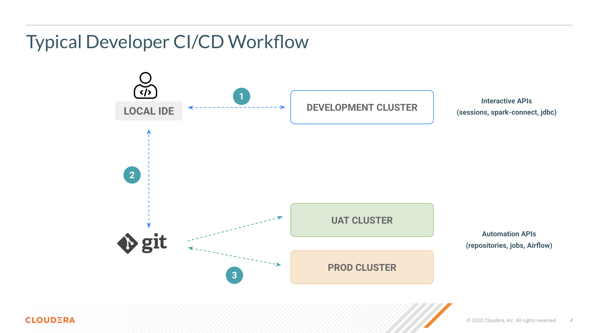
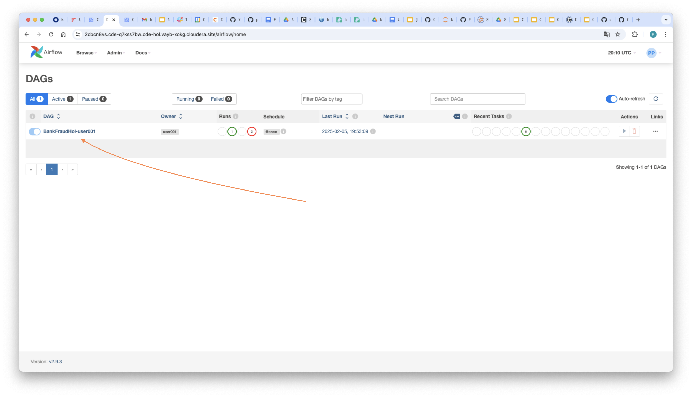
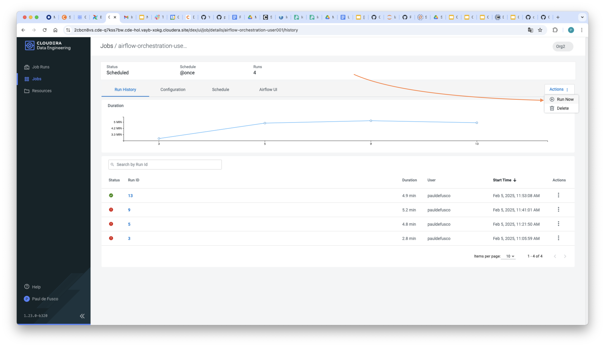
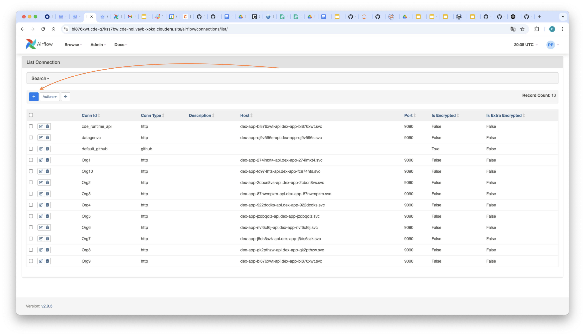

# Deployment & Orchestration with Airflow in CDE



## Contents

3. [Promote to higher env using API by replicating repo and redeploy](https://github.com/pdefusco/CDE_123_HOL/blob/main/step_by_step_guides/english/03-deployment.md#lab-3-promote-to-higher-env-using-api-by-replicating-repo-and-redeploy)
4. [Build Orchestration Pipeline with Airflow](https://github.com/pdefusco/CDE_123_HOL/blob/main/step_by_step_guides/english/03-deployment.md#lab-4-build-orchestration-pipeline-with-airflow)

## Lab 3. Promote to higher env using API by replicating repo and redeploy

Now that the job has succeeded, deploy it into your PRD cluster.

Create and sync the same Git repo from the PRD Cluster. From now on, run the following CLI commands with your PRD's cluster's Jobs API URL as the vcluster-endpoint parameter.

```
cde repository create \
  --name sparkAppRepoPrdUser001 \
  --branch main \
  --url https://github.com/pdefusco/CDE_123_HOL.git \
  --vcluster-endpoint <your-PRD-vc-jobs-api-url-here>
```

```
cde repository sync \
  --name sparkAppRepoPrdUser001 \
  --vcluster-endpoint <your-PRD-vc-jobs-api-url-here>
```

For example:

```
cde repository create \
  --name sparkAppRepoPrdUser001 \
  --branch main \
  --url https://github.com/pdefusco/CDE_123_HOL.git \
  --vcluster-endpoint https://rncv8wqr.cde-mbk2gj8x.pdf-3425.a465-9q4k.cloudera.site/dex/api/v1
```

```
cde repository sync \
  --name sparkAppRepoPrdUser001 \
  --vcluster-endpoint https://rncv8wqr.cde-mbk2gj8x.pdf-3425.a465-9q4k.cloudera.site/dex/api/v1
```

Then create a CDE Spark Job leveraging the CDE repository as a dependency.

```
cde job create --name cde_spark_job_prd_user001 \
  --type spark \
  --mount-1-resource sparkAppRepoPrdUser001 \
  --executor-cores 2 \
  --executor-memory "4g" \
  --application-file pyspark-app.py\
  --vcluster-endpoint <your-PRD-vc-jobs-api-url-here> \
  --arg <your-storage-location-here> \
  --arg <your-hol-username-here>
```

```
cde job run --name cde_spark_job_prd_user001 \
  --executor-cores 4 \
  --executor-memory "2g" \
  --vcluster-endpoint <your-PRD-vc-jobs-api-url-here>
```

For example:

```
cde job create --name cde_spark_job_prd_user001 \
  --type spark \
  --mount-1-resource sparkAppRepoPrdUser001 \
  --executor-cores 2 \
  --executor-memory "4g" \
  --application-file pyspark-app.py\
  --vcluster-endpoint https://rncv8wqr.cde-mbk2gj8x.pdf-3425.a465-9q4k.cloudera.site/dex/api/v1 \
  --arg s3a://pdf-3425-buk-c59557bd/data/cde-123-demo-experian \
  --arg user001
```

```
cde job run --name cde_spark_job_prd_user001 \
  --executor-cores 4 \
  --executor-memory "2g" \
  --vcluster-endpoint https://rncv8wqr.cde-mbk2gj8x.pdf-3425.a465-9q4k.cloudera.site/dex/api/v1
```


## Lab 4. Build Orchestration Pipeline with Airflow

Create the CDE Spark jobs. Notice these are categorized into Bronze, Silver and Gold following a Lakehouse Data Architecture.

```
cde job create --name cde_spark_job_bronze_user001 \
  --type spark \
  --arg <your-hol-username-here> \
  --arg <your-storage-location-here> \
  --mount-1-resource sparkAppRepoPrdUser001 \
  --python-env-resource-name Python-Env-Shared \
  --executor-cores 2 \
  --executor-memory "4g" \
  --application-file de-pipeline/spark/001_Lakehouse_Bronze.py\
  --vcluster-endpoint <your-PRD-vc-jobs-api-url-here>
```

```
cde job create --name cde_spark_job_silver_user001 \
  --type spark \
  --arg <your-hol-username-here> \
  --mount-1-resource sparkAppRepoPrdUser001 \
  --python-env-resource-name Python-Env-Shared \
  --executor-cores 2 \
  --executor-memory "4g" \
  --application-file de-pipeline/spark/002_Lakehouse_Silver.py\
  --vcluster-endpoint <your-PRD-vc-jobs-api-url-here>
```

```
cde job create --name cde_spark_job_gold_user001 \
  --type spark \
  --arg <your-hol-username-here> \
  --arg <your-storage-location-here> \
  --mount-1-resource sparkAppRepoPrdUser001 \
  --python-env-resource-name Python-Env-Shared \
  --executor-cores 2 \
  --executor-memory "4g" \
  --application-file de-pipeline/spark/003_Lakehouse_Gold.py\
  --vcluster-endpoint <your-PRD-vc-jobs-api-url-here>
```

For example:

```
cde job create --name cde_spark_job_bronze_user001 \
  --type spark \
  --arg user001 \
  --arg s3a://pdf-3425-buk-c59557bd/data/cde-123-demo-experian \
  --mount-1-resource sparkAppRepoPrdUser001 \
  --python-env-resource-name Python-Env-Shared \
  --executor-cores 2 \
  --executor-memory "4g" \
  --application-file de-pipeline/spark/001_Lakehouse_Bronze.py\
  --vcluster-endpoint https://rncv8wqr.cde-mbk2gj8x.pdf-3425.a465-9q4k.cloudera.site/dex/api/v1
```

```
cde job create --name cde_spark_job_silver_user001 \
  --type spark \
  --arg user001 \
  --mount-1-resource sparkAppRepoPrdUser001 \
  --python-env-resource-name Python-Env-Shared \
  --executor-cores 2 \
  --executor-memory "4g" \
  --application-file de-pipeline/spark/002_Lakehouse_Silver.py\
  --vcluster-endpoint https://rncv8wqr.cde-mbk2gj8x.pdf-3425.a465-9q4k.cloudera.site/dex/api/v1
```

```
cde job create --name cde_spark_job_gold_user001 \
  --type spark \
  --arg user001 \
  --arg s3a://pdf-3425-buk-c59557bd/data/cde-123-demo-experian \
  --mount-1-resource sparkAppRepoPrdUser001 \
  --python-env-resource-name Python-Env-Shared \
  --executor-cores 2 \
  --executor-memory "4g" \
  --application-file de-pipeline/spark/003_Lakehouse_Gold.py\
  --vcluster-endpoint https://rncv8wqr.cde-mbk2gj8x.pdf-3425.a465-9q4k.cloudera.site/dex/api/v1
```

In your editor, open the Airflow DAG "004_airflow_dag_git" and edit your username variable at line 54.


Then create the CDE Airflow job. This job will orchestrate your Lakehouse Spark jobs above.

```
cde job create --name airflow-orchestration-user001 \
  --type airflow \
  --mount-1-resource sparkAppRepoPrdUser001 \
  --dag-file de-pipeline/airflow/004_airflow_dag_git.py\
  --vcluster-endpoint <your-PRD-vc-jobs-api-url-here>
```

For example:

```
cde job create --name airflow-orchestration-user001 \
  --type airflow \
  --mount-1-resource sparkAppRepoPrdUser001 \
  --dag-file de-pipeline/airflow/004_airflow_dag_git.py\
  --vcluster-endpoint https://rncv8wqr.cde-mbk2gj8x.pdf-3425.a465-9q4k.cloudera.site/dex/api/v1
```


There is no need to manually trigger the Airflow job run. The DAG parameters already include a schedule. Upon creation, the CDE Airflow Job will run shortly. You can follow along progress in the Job Runs UI.


You can use the Airflow UI to inspect your pipelines. From the Virtual Cluster Details page, open the Airflow UI and then locate your Airflow DAG.





Airflow provides a variety of diagrams, charts, and visuals to monitor your executions across tasks, dags, and operators. Run your Airflow DAG multiple times from the CDE Jobs UI and come back to the Airflow UI to inspect your tasks across different runs, and more.




CDE Airflow supports 3rd party providers i.e. external packages that extend Apache Airflow’s functionality by adding integrations with other systems, services, and tools such as AWS, Google Cloud, Microsoft Azure, databases, message brokers, and many other services. Providers are open sourced and can be installed separately based on the specific needs of a project.

Select the GitHub List Repos Task, open the logs and notice the output is provided. In this particular task you used the GitHub Operator to list repositories from a GitHub account.


An Airflow Connection was created ahead of time to connect to this account via GitHub token. Open the Connections page to explore more connections.





The GitHub Operator was installed in the Virtual Cluster's Airflow Python environment. Navigate back to the Virtual Cluster Details page, open the Airflow tab and validate the installed packages.


## Summary and Next Steps

Apache Airflow is an open-source workflow automation and orchestration tool designed for scheduling, monitoring, and managing complex data pipelines. It allows users to define workflows as Directed Acyclic Graphs (DAGs) using Python, enabling flexibility, scalability, and automation in data processing. With built-in integrations, a user-friendly web interface, and robust task execution capabilities, Airflow is widely used in data engineering, ETL processes, and machine learning pipelines.

CDE embeds Apache Airflow at the CDE Virtual Cluster level. It is automatically deployed for the CDE user during CDE Virtual Cluster creation and requires no maintenance on the part of the CDE Admin.

In this section of the labs we deployed a Spark and Iceberg pipeline with git and CDE repositories, and created a job orchestration pipeline with Airflow. You might also find the following articles and demos relevant:

* [CDE Airflow Documentation](https://docs.cloudera.com/cdp-private-cloud-upgrade/latest/cdppvc-data-migration-spark/topics/cdp-migration-spark-cde-airflow-overview.html)
* [Using Airflow in CDE](https://docs.cloudera.com/cdp-private-cloud-upgrade/latest/cdppvc-data-migration-spark/topics/cdp-migration-spark-cde-using-airflow.html)
* [Creating a CDE Repository in CDE](https://docs.cloudera.com/data-engineering/1.5.4/manage-jobs/topics/cde-git-repo.html)
