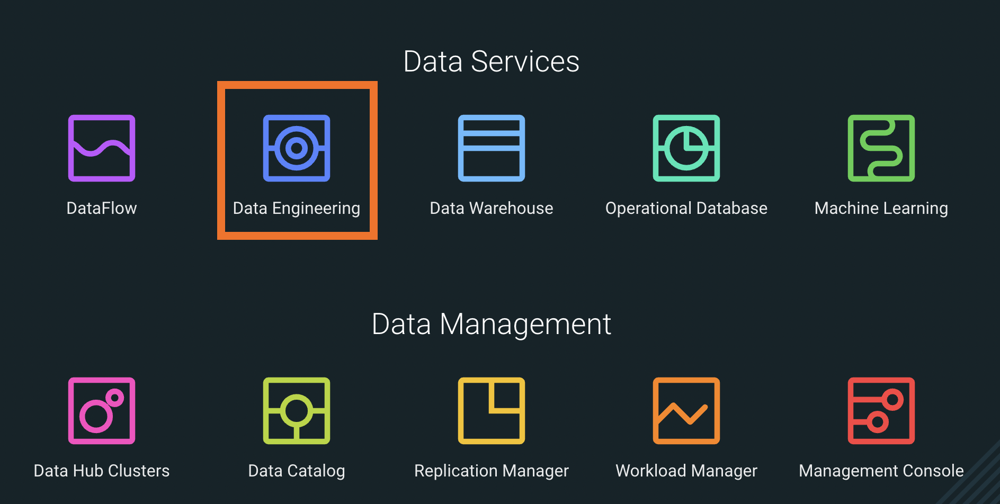
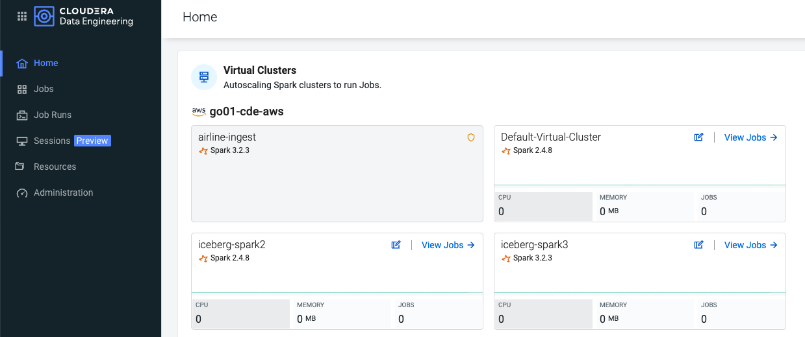

# Architettura di CDE

## Obiettivo

In questa sezione imparerai a conoscere l'architettura flessibile di CDE e i suoi principali componenti.

## Indice dei Contenuti

* [Introduzione al Servizio CDE](https://github.com/pdefusco/CDE119_ACE_WORKSHOP/blob/main/step_by_step_guides/english/part01_cde_architecture.md#introduzione-al-servizio-cde)
  * [Ambiente CDP](https://github.com/pdefusco/CDE119_ACE_WORKSHOP/blob/main/step_by_step_guides/english/part01_cde_architecture.md#ambiente-cdp)
  * [Servizio CDE](https://github.com/pdefusco/CDE119_ACE_WORKSHOP/blob/main/step_by_step_guides/english/part01_cde_architecture.md#servizio-cde)
  * [Cluster Virtuale](https://github.com/pdefusco/CDE119_ACE_WORKSHOP/blob/main/step_by_step_guides/english/part01_cde_architecture.md#cluster-virtuale)
  * [Job CDE](https://github.com/pdefusco/CDE119_ACE_WORKSHOP/blob/main/step_by_step_guides/english/part01_cde_architecture.md#jobs)
  * [Risorse CDE](https://github.com/pdefusco/CDE119_ACE_WORKSHOP/blob/main/step_by_step_guides/english/part01_cde_architecture.md#resource)
  * [Esecuzione del Job](https://github.com/pdefusco/CDE119_ACE_WORKSHOP/blob/main/step_by_step_guides/english/part01_cde_architecture.md#job-run)
  * [Sessioni CDE](https://github.com/pdefusco/CDE119_ACE_WORKSHOP/blob/main/step_by_step_guides/english/part01_cde_architecture.md#sessioni-cde)
  * [Apache Iceberg](https://github.com/pdefusco/CDE119_ACE_WORKSHOP/blob/main/step_by_step_guides/english/part01_cde_architecture.md#apache-iceberg)
  * [Interfaccia Utente CDE](https://github.com/pdefusco/CDE119_ACE_WORKSHOP/blob/main/step_by_step_guides/english/part01_cde_architecture.md#interfaccia-utente-cde)
* [Sommario](https://github.com/pdefusco/CDE119_ACE_WORKSHOP/blob/main/step_by_step_guides/english/part01_cde_architecture.md#sommario)

## Introduzione al Servizio CDE

Cloudera Data Engineering (CDE) è un servizio per Cloudera Data Platform che ti permette di inviare job batch a cluster virtuali auto-scalanti. CDE ti consente di dedicare più tempo alle tue applicazioni e meno tempo all'infrastruttura.

Cloudera Data Engineering ti permette di creare, gestire e programmare job Apache Spark senza il sovraccarico di creare e mantenere cluster Spark. Con Cloudera Data Engineering, definisci cluster virtuali con una gamma di risorse CPU e memoria, e il cluster si scala automaticamente in base alle necessità per eseguire i tuoi carichi di lavoro Spark, aiutando a controllare i costi nel cloud.

Il servizio CDE può essere raggiunto dalla pagina principale di CDP facendo clic sull'icona blu "Data Engineering".

La pagina di atterraggio CDE consente di accedere, creare e gestire Cluster Virtuali CDE. All'interno di ciascun Cluster Virtuale CDE puoi creare, monitorare e risolvere problemi dei Job Spark e Airflow.

Il Cluster Virtuale è associato all'Ambiente CDP. Ogni Cluster Virtuale CDE è mappato al massimo a un Ambiente CDP, mentre un Ambiente CDP può essere mappato a uno o più Cluster Virtuali.

Questi sono i componenti più importanti nel Servizio CDE:

##### Ambiente CDP
Un sottoinsieme logico del tuo account del provider di cloud, che include una rete virtuale specifica. Gli Ambienti CDP possono essere in AWS, Azure, RedHat OCP e Cloudera ECS. Per maggiori informazioni, consulta [Ambienti CDP](https://docs.cloudera.com/management-console/cloud/overview/topics/mc-core-concepts.html). Praticamente parlando, un ambiente è equivalente a un Data Lake, poiché ogni ambiente è automaticamente associato ai suoi propri servizi SDX per Sicurezza, Governance e Lineage.

##### Servizio CDE
Il cluster Kubernetes a lungo termine e i servizi che gestiscono i cluster virtuali. Il servizio CDE deve essere abilitato su un ambiente prima di poter creare qualsiasi cluster virtuale.

##### Cluster Virtuale
Un cluster auto-scalante individuale con intervalli predefiniti di CPU e memoria. I Cluster Virtuali in CDE possono essere creati e eliminati su richiesta. I job sono associati ai cluster. Fino alla versione 1.18 di CDE, era disponibile solo un tipo di Cluster Virtuale. A partire dalla versione 1.19, puoi scegliere tra due livelli di Cluster:

*Core (Tier 1)*: Le opzioni di trasformazione e ingegneria basate su batch includono:
* Cluster auto-scalanti
* Spot Instances
* SDX/Lakehouse
* Ciclo di vita del Job
* Monitoraggio
* Orchestrazione dei Workflow

*Tutti gli scopi (Tier 2)*: Sviluppa utilizzando sessioni interattive e distribuisci carichi di lavoro batch e streaming. Questa opzione include tutte le opzioni del Tier 1 con l'aggiunta delle seguenti:
* Sessioni Shell - CLI e Web
* JDBC/SparkSQL (Disponibile da ottobre 2023 con CDE 1.20)
* IDE (Disponibile da ottobre 2023 con CDE 1.20)

I cluster Core sono raccomandati come ambienti di produzione. I cluster All Purpose sono progettati per essere utilizzati come ambienti di sviluppo e test.
Per maggiori informazioni sulle versioni 1.19.1 e 1.19.2 di CDE, visita questa pagina nella [documentazione](https://docs.cloudera.com/data-engineering/cloud/release-notes/topics/cde-whats-new-1.19.html).

##### Jobs
Codice applicativo insieme a configurazioni e risorse definite. I job possono essere eseguiti su richiesta o programmati. Un'esecuzione individuale di un job è chiamata esecuzione del job.

##### Risorsa
Una raccolta definita di file come un file Python o un'applicazione JAR, dipendenze e qualsiasi altro file di riferimento necessario per un job.

##### Esecuzione del Job
Un'esecuzione individuale di un job.

##### Sessione CDE
Le sessioni interattive CDE offrono agli ingegneri dei dati punti di accesso flessibili per iniziare a sviluppare applicazioni Spark da qualsiasi luogo: in un terminale web-based, CLI locale, IDE preferito, e persino tramite JDBC da strumenti di terze parti.

##### Apache Iceberg
Apache Iceberg è un formato di tabella open-source e cloud-native ad alte prestazioni per organizzare dataset analitici su scala petabyte su un file system o object store. Combinato con Cloudera Data Platform (CDP), gli utenti possono costruire un'architettura di lakehouse aperto per analisi multi-funzionali e per distribuire pipeline end-to-end su larga scala.

Open Data Lakehouse su CDP semplifica le analisi avanzate su tutti i dati con una piattaforma unificata per dati strutturati e non strutturati e servizi di dati integrati per abilitare qualsiasi caso d'uso analitico, dal ML, BI all'analisi in streaming e in tempo reale. Apache Iceberg è l'ingrediente segreto del lakehouse aperto.

Iceberg è compatibile con una varietà di motori di calcolo, tra cui Spark. CDE ti consente di distribuire Cluster Virtuali abilitati per Iceberg.

Per maggiori informazioni visita la [documentazione](https://iceberg.apache.org/).

##### Interfaccia Utente CDE

Ora che hai coperto le basi di CDE, prenditi qualche minuto per familiarizzare con la pagina di atterraggio di CDE.

La Home Page fornisce una panoramica ad alto livello di tutti i Servizi CDE e i Cluster. È stata ridisegnata nella versione 1.19 per includere anche scorciatoie per diverse azioni come la creazione di Job e Risorse CDE o la visita della documentazione.

In alto, hai scorciatoie per creare Job e Risorse CDE.

Scorri verso il basso fino alla sezione Cluster Virtuali CDE e nota che tutti i Cluster Virtuali e ciascun Ambiente CDP / Servizio CDE associato sono mostrati.

Successivamente, apri la pagina di Amministrazione nel tab a sinistra. Questa pagina mostra anche i Servizi CDE a sinistra e i Cluster Virtuali associati a destra.

Apri la pagina Dettagli Servizio CDE e nota le seguenti informazioni e link chiave:

* Versione CDE
* Intervallo di Autoscaling dei Nod
* CDP Data Lake e Ambiente
* Grafana Charts. Fai clic su questo link per ottenere una dashboard delle risorse Kubernetes del servizio in esecuzione.
* Resource Scheduler. Fai clic su questo link per visualizzare l'interfaccia Web Yunikorn.

Scorri verso il basso e apri la scheda Configurazioni. Nota che questo è il luogo dove vengono definiti i tipi di istanza e gli intervalli di autoscaling delle istanze.

Per saperne di più su altre configurazioni importanti del servizio visita [Abilitare un Servizio CDE](https://docs.cloudera.com/data-engineering/cloud/enable-data-engineering/topics/cde-enable-data-engineering.html) nella documentazione CDE.

Naviga di nuovo alla pagina di Amministrazione e apri la pagina Dettagli Cluster di un Cluster Virtuale.

Questa vista include altre informazioni importanti sulla gestione del cluster. Da qui puoi:

* Scaricare i binari del CLI CDE. Si consiglia di utilizzare il CLI per inviare job e interagire con CDE. È trattato nella Parte 3 di questa guida.
* Visitare la documentazione dell'API per conoscere l'API CDE e costruire richieste di esempio nella pagina Swagger.
* Accedere all'UI di Airflow per monitorare i tuoi Job Airflow, configurare connessioni personalizzate, variabili e altro.

Apri la scheda Configurazione. Nota che puoi selezionare tra Cluster Core e Cluster All Purpose.
Inoltre, questa vista fornisce opzioni per impostare gli intervalli di autoscaling della CPU e della memoria, versione di Spark, e le opzioni di Iceberg sono impostate qui.
CDE supporta Spark 2.4.8, 3.2.3, 3.3.0 e 3.5.1.

Per maggiori informazioni sull'Architettura CDE visita [Creare e Gestire Cluster Virtuali](https://docs.cloudera.com/data-engineering/cloud/manage-clusters/topics/cde-create-cluster.html) e [Raccomandazioni per la Scalabilità dei Deployment CDE](https://docs.cloudera.com/data-engineering/cloud/deployment-architecture/topics/cde-general-scaling.html)

## Sommario

Un Servizio CDE definisce i tipi di istanza di calcolo, gli intervalli di autoscaling delle istanze e il CDP Data Lake associato. I Dati e gli Utenti associati al Servizio sono soggetti a SDX e alle impostazioni dell'Ambiente CDP. Puoi sfruttare SDX Atlas e Ranger per visualizzare i metadati delle tabelle e dei job e garantire l'accesso sicuro degli utenti e dei dati con politiche di controllo fine-granulari.

All'interno di un Servizio CDE puoi distribuire uno o più Cluster Virtuali CDE. L'Intervallo di Autoscaling del Servizio è il numero minimo/massimo di Istanza di Calcolo consentito. L'Intervallo di Autoscaling del Cluster Virtuale è la quantità minima/massima di CPU e Memoria che possono essere utilizzate da tutti i Job CDE all'interno del cluster. L'Intervallo di Autoscaling del Cluster Virtuale è naturalmente vincolato dalla CPU e dalla Memoria disponibili a livello di Servizio.

CDE supporta le versioni di Spark 2.4.8, 3.2.3, 3.3.0 e 3.5.1. I Cluster Virtuali CDE vengono distribuiti con una versione di Spark per ogni Cluster Virtuale.

Questa architettura flessibile ti consente di isolare i tuoi carichi di lavoro e limitare l'accesso all'interno di diversi cluster di calcolo auto-scalabili, predefinendo al contempo i limiti di gestione dei costi a livello aggregato. Ad esempio, puoi definire Servizi a livello di organizzazione e Cluster Virtuali al loro interno come DEV, QA, PROD, ecc.

CDE sfrutta la pianificazione delle risorse YuniKorn e le politiche di ordinamento, come la pianificazione di gruppo e il packing, per ottimizzare l'utilizzo delle risorse e migliorare l'efficienza dei costi. Per maggiori informazioni sulla pianificazione di gruppo, leggi il post del blog Cloudera [Spark su Kubernetes – Pianificazione di Gruppo con YuniKorn](https://blog.cloudera.com/spark-on-kubernetes-gang-scheduling-with-yunikorn/).

L'auto-scaling del Job Spark di CDE è controllato dall'allocazione dinamica di Apache Spark. L'allocazione dinamica scala gli esecutori dei job su e giù secondo le necessità per i job in esecuzione. Questo può portare a grandi vantaggi in termini di prestazioni allocando tante risorse quante ne sono necessarie per il job in esecuzione e restituendo risorse quando non sono più necessarie, permettendo ai job concorrenti di potenzialmente eseguire più velocemente.
